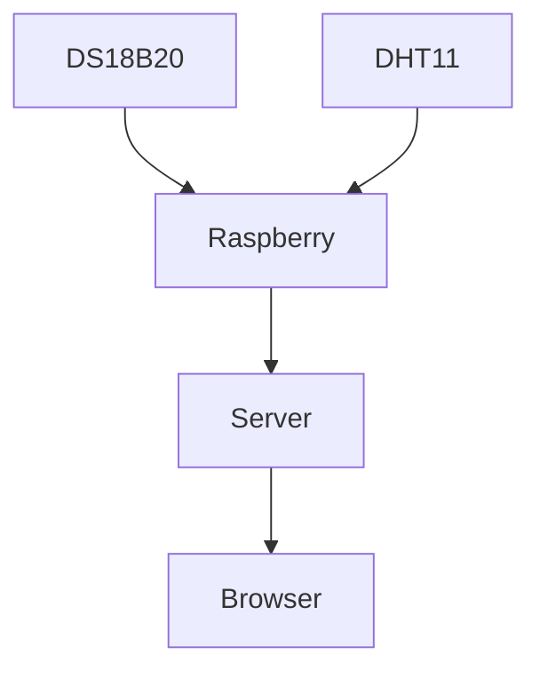
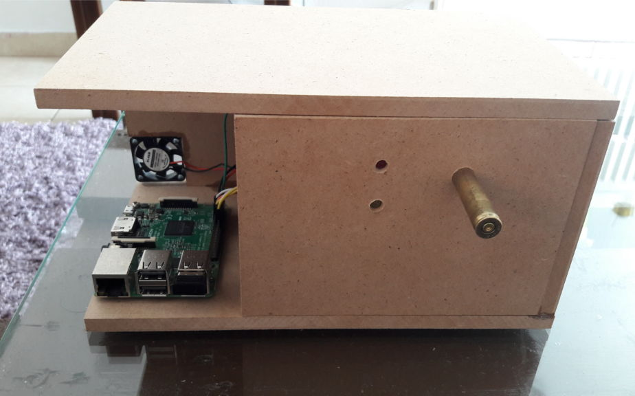

# Home Temperature Station

The hardware is:
<ul>
	<li>Raspberry Pi</li>
	<li>DS18B20 for temperature (±0.1°C)</li>
	<li>DHT-11 for Humidity (5% accuracy) and temperature (±2°C accuracy)</li>
</ul>
The data is stored on sqlite3.
<p>Sqlite3 file is available <a href="https://tsaklidis.gr/home/home_data.sqlite3">here</a> </p>

<p>Check the live version https://tsaklidis.gr/home/index.php</p>


I use the system's cron to run the script and monitor the output. To edit the cron use 

```shell
crontab -e
```
And run the script every 5 minutes
```shell
*/5 * * * * python ~/send_data.py >> ~/info.log 2>&1
```

The flow is:


> TODO:
> <ul>
>	<li>On data loss, save all the data saved to pickle file</li>
> </ul>

If you have any questions or problems running the scripts just contact me. 


<hr>



