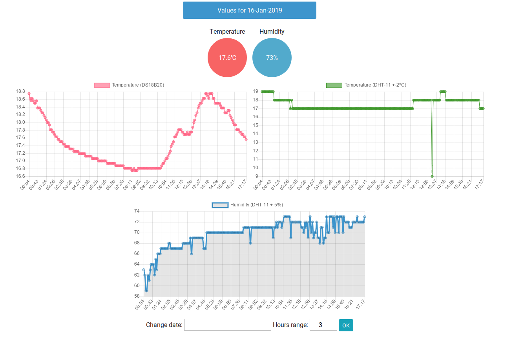

# Home Temperature Station

The hardware is:
<ul>
	<li>Raspberry Pi</li>
	<li>DS18B20 for temperature (±0.1°C)</li>
	<li>DHT-11 for Humidity (5% accuracy) and temperature (±2°C accuracy)</li>
</ul>
The data is stored on sqlite3.

Check on line https://tsaklidis.gr/home/index.php

Sqlite3 file is available <a href="https://tsaklidis.gr/home/home_data.sqlite3">here</a> 

