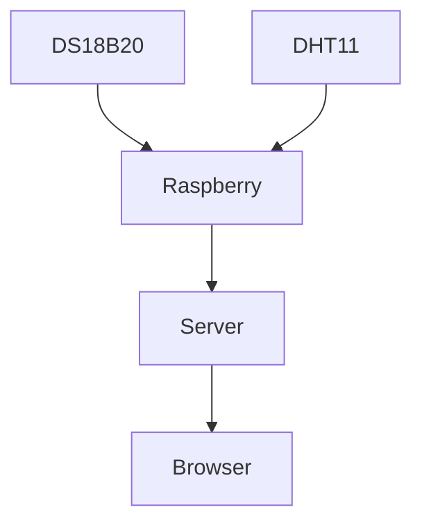
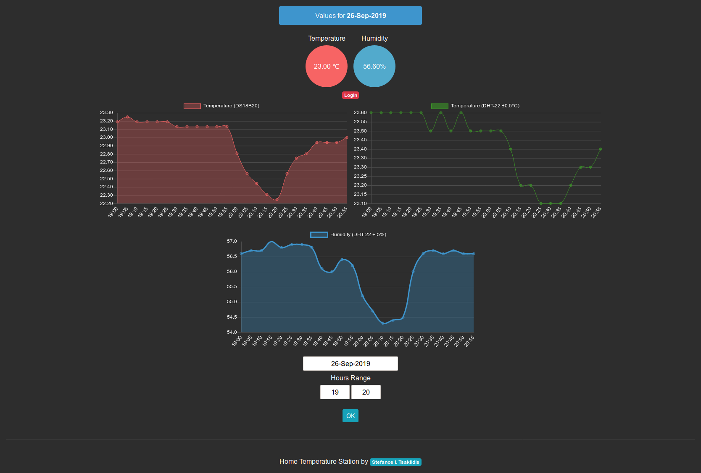
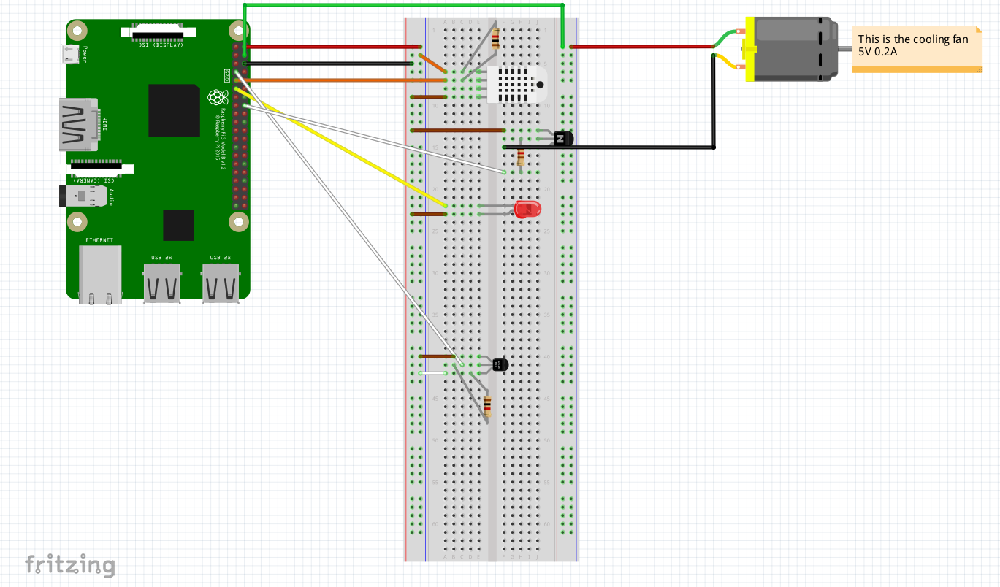
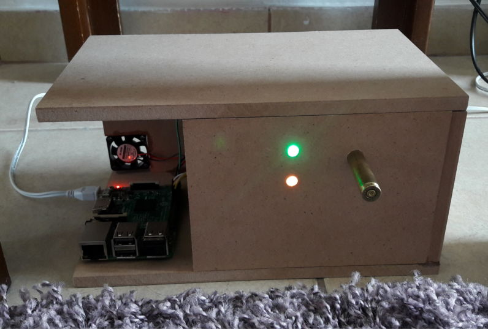
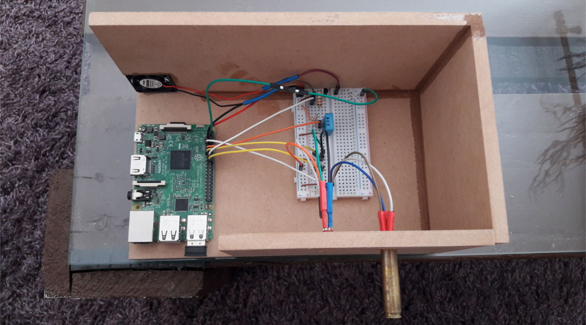

# Home Temperature Station

The hardware is:
<ul>
	<li>Raspberry Pi</li>
	<li>DS18B20 for temperature (±0.1°C)</li>
	<li>DHT-22 for Humidity (5% RH accuracy) and temperature (±0.5°C accuracy)</li>
</ul>
The data is stored on sqlite3.
<p>Sqlite3 file is available <a href="https://tsaklidis.gr/home/home_data.sqlite3">here</a> </p>

<p>Check the live version https://tsaklidis.gr/home/index.php</p>


I use the system's cron to run the script and monitor the output. To edit the cron use 

```shell
crontab -e
```
And run the script every 5 minutes
```shell
*/5 * * * * python ~/send_data.py >> ~/info.log 2>&1
```

In order to run the fan.py script on each system start, add the file
```shell
# nano /lib/systemd/system/fan.service

```

In the file add:
```shell
[Unit]
Description=run fan when cpu temp high
After=meadiacenter.service

[Service]
# If User and Group are not specified, then by default systemd ExecStart runs as root
User=root
Group=root
Type=simple
ExecStart=/usr/bin/python /home/pi/fan.py
# write to journal or within script to separate log file
#StandardOutput=/home/pi/fan.log
#StandardError=/home/pi/fan_error.log
Restart=Always

[Install]
WantedBy=multi-user.target

```

The flow is:


To save the data on your db upload the contents of the store_data folder to an apache or nginx public folder.

> TODO:
> <ul>
>	<li>On data loss, save all the data saved to pickle file</li>
> </ul>

If you have any questions or problems running the scripts just contact me. 





<hr>



